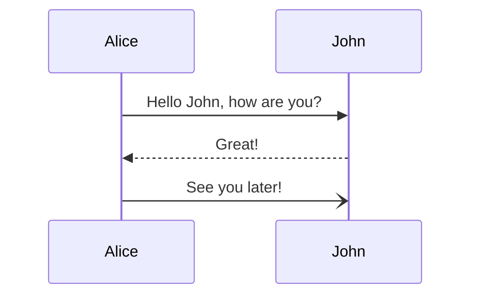
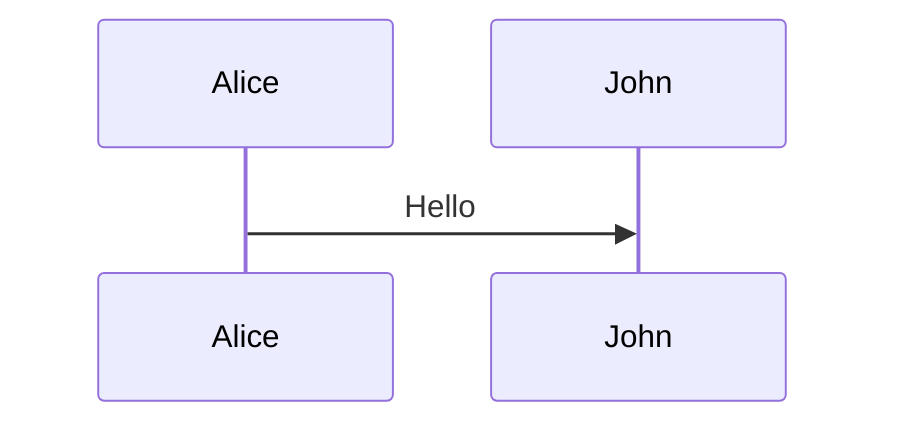

# saburto-decks

Write [**infodecks**](https://martinfowler.com/bliki/Infodeck.html) — decks meant to be read — in
MDX. Author one file, then use it two ways: **embedded** in a page, showing one slide at a time in
a box the page provides, and **presented full screen** from the same file. No second copy, no
audience-facing slides-plus-article.

A deck is a React component. Embedding one is importing a component and rendering it, whether the
host page is an Astro site or a plain React app.

> **Status: walking skeleton.** The whole path works end to end — authoring, compiling, embedding,
> presenting, and returning the reader to their place — with a deliberately narrow feature set.
> [PLAN.md](PLAN.md) holds the requirements, including what "done" means for this version.

## Quick start

```bash
bun install
bun run build     # the library, then both demo hosts
bun run demo      # → http://127.0.0.1:4173/  (the Astro host)
bun run dev       # the Astro host with hot reload
bun run dev:react # the React host with hot reload
```

Two demo hosts are in this repository, deliberately: `demo/` is an **Astro** site, `react-demo/`
is a **plain React app**, and both embed the same deck from `decks/example.mdx`.

## Writing a deck

A deck is one MDX file. A slide ends at a line containing only `---`:

```mdx
---
title: Saburto Decks
---

# A deck title

Body text, with **emphasis**, `inline code` and [links](https://example.com).

---

## Slide two

- a list
- of items

---

Slide three.
```

`---` is ordinary Markdown, so the file stays readable in any editor. Frontmatter's own `---` are
parsed first, so they never split a slide. A slide may contain headings, paragraphs, lists, links,
emphasis, inline code, highlighted code blocks (R3, R11), hand-drawn annotations and Mermaid
diagrams (R13); anything MDX can render will work, but nothing else is promised.

The deck's frontmatter `title` is available to the host as `frontmatter` from the same import.

### Code

Fenced code is syntax-highlighted **at build time**. The highlighter runs while the deck is
compiled, so the page receives only the finished, coloured markup — no highlighter, grammars or
theme are ever shipped to the browser (R11). A snippet wraps rather than scrolls, and shrinks to
fit its slide like everything else.

````mdx
```tsx [Post.tsx] {1|3|all}
import { Deck } from '@saburto/saburto-decks'

<Deck slides={slides} />
```
````

Two pieces of fence metadata are understood, and both are optional:

- `[Post.tsx]` (or `title="Post.tsx"`) names the file, shown in a bar above the block.
- `{…}` marks lines to draw the eye. `{1,3-5}` highlights a fixed set; with `|` it becomes a
  **sequence of steps** the reader advances through, as in Slidev: `{1|3-5|all}`. `all` — or `*`,
  or an empty step — means every line; `none` shows the block with nothing highlighted, so every
  line recedes; `hide` takes the block (and its file name) off the slide for that step.

Steps are part of the deck's navigation, not a thing of their own: `→`, `Space` and the bar's
next control move to the next step, and only leave the slide after the last one. `←` walks back,
and from a slide's first step returns to the previous slide's last step. Clicking the slide
advances too. The bar shows a dot per step, and the position is announced to screen readers (R12).

Highlighting follows Shiki and Slidev: the current step's lines keep the colour they always had,
and the lines it does not name are dimmed. No line is boxed or restyled, so the code reads the
same throughout — only the emphasis moves.

Code follows the deck's theme: every token carries a light and a dark colour, and the deck picks
one from the `theme` it was given, exactly as the rest of the slide does.

### Diagrams

A fenced `mermaid` block is drawn as a diagram, not shown as its source (R13):

````mdx

````

A **sequence diagram** is revealed one element at a time, in the order the diagram declares
itself: each participant, then each message or note (R14). A **flowchart**, a **state diagram** and
a **class diagram** are revealed the same way: each node, then each edge. That reveal is part of
the deck's navigation, exactly like a code block's steps — `→` moves to the next element, the bar
shows a dot per step, and the reader only leaves the slide after the last one. Other kinds of
diagram, such as a pie chart or a Gantt chart, are shown whole.

A diagram follows the deck's theme, and is redrawn when the host changes it. Like all slide
content it is measured against the deck's box and scaled to fit, never scrolled.

Mermaid is loaded only when a deck actually contains a diagram, and it is a dependency of the
package, so a host's bundler brings it in on demand. A deck with no diagram never loads it.

Write `{full}` in the fence meta to show a sequence diagram whole instead of stepping through it:

````mdx

````

### Annotations

Bring a passage forward by wrapping it in a `<Mark>`. A hand-drawn mark is drawn over the words:

```mdx
Press <Mark type="box">Full screen</Mark> to present, or
<Mark type="circle" at={2} color="accent">Escape</Mark> to come back.
```

| Prop | Type | Notes |
| --- | --- | --- |
| `type` | `highlight`, `underline`, `box`, `circle`, `strike-through`, `crossed-off`, `bracket` | what to draw; `highlight` by default |
| `color` | a CSS colour, or a palette name (`accent`, `muted`, `fg`, `bg`, `highlight`) | a highlight uses `--sd-highlight`; the outline kinds use the text's own colour |
| `at` | `number` | the step the mark is revealed on, counted with the slide's other steps; with the slide when omitted |
| `multiline` | `boolean` | draw the mark per line, for a passage that wraps |
| `brackets` | `left`, `right`, `top`, `bottom` | which side a `bracket` sits on |

The mark is decoration — the words are on the slide whether or not the mark is — so it changes
neither the text nor how the slide fits. A mark with an `at` takes part in the slide's steps: the
dots, the keyboard and Next/Previous treat it like a code block or a diagram step, and the reader
only leaves the slide after it. The drawing follows the deck's theme and palette, and is drawn in
as it appears unless the reader prefers reduced motion.

Annotations are an extra dependency only when a slide has one: a deck without a `<Mark>` never
loads the library that draws it.

## Embedding a deck

### In Astro

```bash
astro add react            # a deck is a React component
bun add @saburto/saburto-decks
```

```ts
// astro.config.ts
import react from '@astrojs/react'
import { saburtoDecks } from '@saburto/saburto-decks/mdx'

export default defineConfig({
  integrations: [react()],
  vite: { plugins: [saburtoDecks()] }   // compiles every .mdx deck to a React component
})
```

```astro
---
// src/pages/blog/post.astro
import Deck from '@saburto/saburto-decks'
import slides from '../../decks/my-deck.mdx'
---

<BlogPostLayout>
  <p>Article text above the deck.</p>

  <Deck slides={slides} client:load />

  <p>Article text below it.</p>
</BlogPostLayout>
```

Astro's own MDX integration is **not** what you want here, and adding it would not help: it
compiles MDX to Astro components, and a deck is a React component. `saburtoDecks()` brings the MDX
pipeline a deck needs, with the remark plugins that make `---` mean "next slide".

### In a React app

```tsx
import { Deck } from '@saburto/saburto-decks'
import slides from './my-deck.mdx'

export default function Post() {
  return (
    <>
      <p>Article text above the deck.</p>
      <Deck slides={slides} />
      <p>Article text below it.</p>
    </>
  )
}
```

```ts
// vite.config.ts
import { saburtoDecks } from '@saburto/saburto-decks/mdx'

export default defineConfig({ plugins: [saburtoDecks()] })
```

React is a peer dependency: the host's React is used, and a deck never carries a second copy.

## Props

| Prop | Type | Notes |
| --- | --- | --- |
| `slides` | React component | the compiled deck: `import slides from './my-deck.mdx'` |
| `defaultSlide` | `number` | which slide to start on |
| `theme` | `'light' \| 'dark' \| 'system'` | the host decides; the deck never guesses |
| `onSlideChange` | `(index, count) => void` | told when the slide changes |
| `onStepChange` | `(step, stepCount) => void` | told when the step within a slide changes (R12) |
| `onModeChange` | `(mode) => void` | told when the deck enters or leaves present mode |

Anything else — `id`, `className`, `style`, `aria-label`, `data-*` — goes to the deck's element in
the page, so the host can lay it out like any other block.

## Driving a deck from the host

A ref exposes what a host page's own logic needs: a route change, a keyboard shortcut, a control
of its own.

```tsx
const deck = useRef<DeckHandle>(null)

<button onClick={() => deck.current?.present()}>Present</button>
<Deck ref={deck} slides={slides} />

deck.current?.goTo(2)         // 0-based, clamped
deck.current?.goTo(2, 1)      // …and to step 1 within it
deck.current?.goToStep(2)     // step within the current slide
deck.current?.next()          // also prev(), exitPresent()
```

Note that while a deck is presenting it covers the page, so the host's own buttons are underneath
it: `exitPresent()` from the host's code is how a host ends a presentation itself. The reader can
always leave with `Esc`, or with the deck's own exit control.

## Sizing and theming

The deck fills its container's width and is 16:9 by default. Its type is sized to *its own box*,
not to the page or the viewport — 1cqi is 1% of the deck's width — and is shrunk further if a
slide would not otherwise fit. **A slide is never scrolled**: it is scaled to fit instead.

The host page has the last word on both:

```css
#my-deck { --sd-aspect: 4 / 3 }        /* a squarer box */
#my-deck { width: 30rem }              /* the type follows the box */
#my-deck { --sd-bg: #fffdf5; --sd-accent: #b45309 }
```

| Variable | Use |
| --- | --- |
| `--sd-aspect` | the deck's shape; `auto` to let the host's own `height` decide |
| `--sd-bg` | deck background |
| `--sd-fg` | body text |
| `--sd-muted` | counter and secondary text |
| `--sd-border` | hairlines |
| `--sd-accent` | links |
| `--sd-surface` | inline code and buttons |
| `--sd-highlight` | the colour a `<Mark type="highlight">` is drawn in (translucent, so the words stay readable under it) |
| `--sd-code-dim` | how far the lines outside the current step recede (default `0.3`) |

## Keyboard

| Key | Embedded (once the deck has focus) | Presenting |
| --- | --- | --- |
| `→` `↓` `PageDown` `Space` | next step or slide | next step or slide |
| `←` `↑` `PageUp` | previous step or slide | previous step or slide |
| `Home` / `End` | first / last slide | first / last slide |
| `Esc` | — | leave present mode |
| `Tab` | moves on through the page | cycles within the deck |

The deck takes the keyboard **only while it has focus**; click it, or Tab to it. Everywhere else
the page scrolls normally. While presenting, focus is contained and returned on exit, and
`prefers-reduced-motion` removes the slide transition. Slide changes are announced to screen
readers through a live region.

## Presenting, and coming back

Present mode is a fixed overlay from the deck's own shadow tree, plus the native Fullscreen API
when the browser has it. The overlay is what guarantees a full-screen presentation; fullscreen
only removes the browser chrome, so present mode does not depend on it being available or
permitted.

Leaving present mode puts the deck back on the slide it was on, with the page still scrolled
exactly where you left it. The host element keeps its place in the page's flow while presenting,
so the page's height never changes.

## Isolation

The deck renders inside a shadow root with `all: initial` on its host, so:

- the host page's CSS does not reach into the deck, even hostile rules aimed straight at `h1`,
  `p`, `section` and `button`;
- the deck's CSS does not leak out: a host page looks the same with and without a deck embedded;
- both directions are asserted by the test suite, in both demo hosts.

One consequence worth knowing: because the deck lives in a shadow root, its slides are **not** in
the server-rendered HTML. A page that needs the deck's text for search engines or for readers
without JavaScript would need a different trade-off.

## Tests

```bash
bun run verify      # typecheck → unit → build → e2e
bun run test        # unit tests (Bun): the slide splitter, and a real MDX compile
bun run test:e2e    # end-to-end tests (Playwright) against the built demo sites
```

The end-to-end suite drives both demo hosts in a real browser and covers embedded mode, present
mode, isolation in both directions, host control, keyboard behaviour, focus containment, reduced
motion, the no-Fullscreen-API path, and place restoration. `bun run test:e2e --headed` watches it
work.

### Looking at a deck

The tests assert on the deck; two tools show it to you. Both are development-only and ship
nowhere.

```bash
bun run inspect --slide 5 --step 2                # a slide's state, printed
bun run inspect --slide 8 --shot /tmp/deck.png    # ...and a picture of it
bun run inspect --present --dark                  # full screen, dark theme
bun run inspect --width 16rem --aspect '4 / 3'    # in a cramped box

bun run compile                                   # decks/example.mdx, compiled
bun run compile decks/example.mdx --grep Mark     # just the lines that mention Mark
```

`inspect` needs the host built (`bun run build`); if nothing is serving, it starts the preview
itself and stops it again. `--url http://127.0.0.1:4174/` points it at the React host. `compile`
runs the real build pipeline over a single file, which is what to reach for when a slide, a code
fence or an annotation comes out wrong.

## Requirements

[PLAN.md](PLAN.md) is the requirements document — what the deck must do, and when this version is
finished. This README describes how to use it; where the two could disagree, PLAN.md decides. The
end-to-end tests name the requirement each one covers, so the two can be read side by side.
