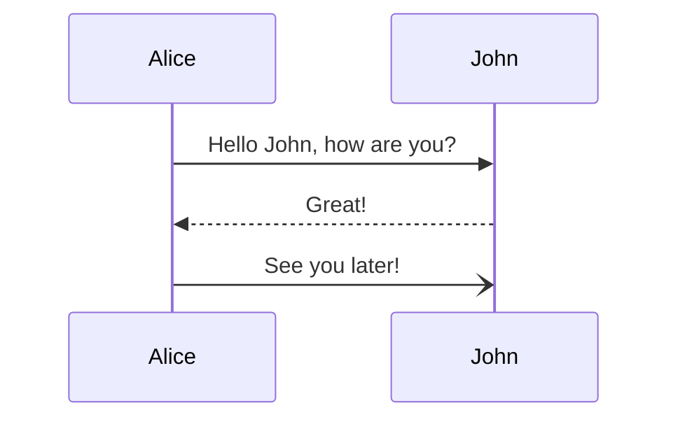
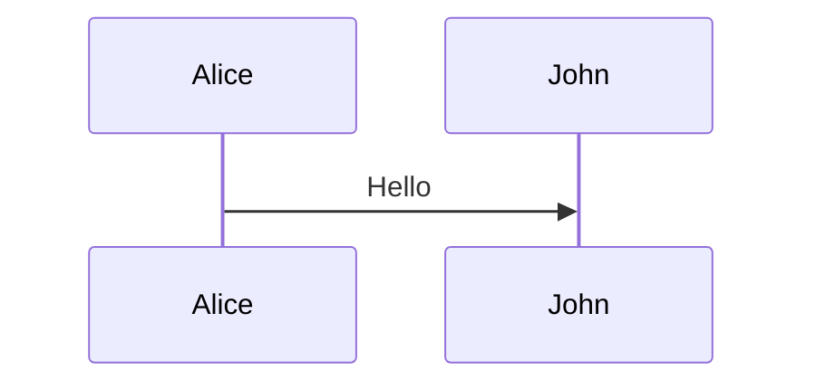
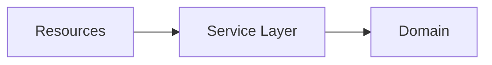

# saburto-decks

Write [**infodecks**](https://martinfowler.com/bliki/Infodeck.html) — decks meant to be read — in
MDX. Author one file, then use it two ways: **embedded** in a page, showing one slide at a time in
a box the page provides, and **presented full screen** from the same file. No second copy, no
audience-facing slides-plus-article.

A deck is a React component. Embedding one is importing a component and rendering it, whether the
host page is an Astro site or a plain React app.

> **Status: walking skeleton.** The whole path works end to end — authoring, compiling, embedding,
> presenting, and returning the reader to their place — with a deliberately narrow feature set.
> [PLAN.md](PLAN.md) holds the requirements, including what "done" means for this version.

## Quick start

```bash
bun install
bun run build     # the library, then both demo hosts
bun run demo      # → http://127.0.0.1:4173/  (the Astro host)
bun run dev       # the Astro host with hot reload
bun run dev:react # the React host with hot reload
```

Two demo hosts are in this repository, deliberately: `demo/` is an **Astro** site, `react-demo/`
is a **plain React app**, and both embed the same deck from `decks/example.mdx`.

## Writing a deck

A deck is one MDX file. A slide ends at a line containing only `---`:

```mdx
---
title: Saburto Decks
---

# A deck title

Body text, with **emphasis**, `inline code` and [links](https://example.com).

---

## Slide two

- a list
- of items

---

Slide three.
```

`---` is ordinary Markdown, so the file stays readable in any editor. Frontmatter's own `---` are
parsed first, so they never split a slide. A slide may contain headings, paragraphs, lists, links,
emphasis, inline code, highlighted code blocks (R3, R11), hand-drawn annotations and arrows
(R15, R19), and Mermaid diagrams (R13), animated objects (R16), the layout components below, and
pictures; anything MDX can render will work, but nothing else is promised.

The deck's frontmatter `title` is available to the host as `frontmatter` from the same import.

### Including another file

A deck can be written as several files. Put `<Slides src="./part.mdx" />` where the included
file's slides should go:

```mdx
# A slide of the deck's own

---

<Slides src="./pages/part-two.mdx" />

---

# Another slide of the deck's own
```

On a slide of its own, the include is that file's slides: they are ordered where the include is
written, counted and navigated with the deck's other slides, and listed in the deck's table of
contents. A file can hold any number of slides, and can include another file in turn.

The same include can sit inside a slide instead — beside other content, in a column, in a stack —
and then it is that slide's content: it adds no slides, and its steps count with the slide's own.

```mdx
<Columns title="…">

<Slides src="./pages/part-two.mdx" />

<Figure src={picture} alt="…" />

</Columns>
```

An include is a real import of the file, so:

- the included file's own relative imports and pictures resolve from its own folder;
- editing the included file reloads the deck while it is being developed;
- a file may include another file, but a file may not include itself;
- the included file's frontmatter, if it has any, is ignored: only its slides are used.

### Code

Fenced code is syntax-highlighted **at build time**. The highlighter runs while the deck is
compiled, so the page receives only the finished, coloured markup — no highlighter, grammars or
theme are ever shipped to the browser (R11). A snippet wraps rather than scrolls, and shrinks to
fit its slide like everything else.

````mdx
```tsx [Post.tsx] {1|3|all}
import { Deck } from '@saburto/saburto-decks'

<Deck slides={slides} />
```
````

Two pieces of fence metadata are understood, and both are optional:

- `[Post.tsx]` (or `title="Post.tsx"`) names the file, shown in a bar above the block.
- `{…}` marks lines to draw the eye. `{1,3-5}` highlights a fixed set; with `|` it becomes a
  **sequence of steps** the reader advances through, as in Slidev: `{1|3-5|all}`. `all` — or `*`,
  or an empty step — means every line; `none` shows the block with nothing highlighted, so every
  line recedes; `hide` takes the block (and its file name) off the slide for that step.

Steps are part of the deck's navigation, not a thing of their own: `→`, `Space` and the bar's
next control move to the next step, and only leave the slide after the last one. `←` walks back,
and from a slide's first step returns to the previous slide's last step. A click on the slide
never moves it. The bar shows a dot per step, and the position is announced to screen readers (R12).

Highlighting follows Shiki and Slidev: the current step's lines keep the colour they always had,
and the lines it does not name are dimmed. No line is boxed or restyled, so the code reads the
same throughout — only the emphasis moves.

Code follows the deck's theme: every token carries a light and a dark colour, and the deck picks
one from the `theme` it was given, exactly as the rest of the slide does.

### Diagrams

A fenced `mermaid` block is drawn as a diagram, not shown as its source (R13):

````mdx

````

A **sequence diagram** is revealed one element at a time, in the order the diagram declares
itself: each participant, then each message or note (R14). A **flowchart**, a **state diagram** and
a **class diagram** are revealed the same way: each node, then each edge. That reveal is part of
the deck's navigation, exactly like a code block's steps — `→` moves to the next element, the bar
shows a dot per step, and the reader only leaves the slide after the last one. Other kinds of
diagram, such as a pie chart or a Gantt chart, are shown whole.

A diagram follows the deck's theme, and is redrawn when the host changes it. Like all slide
content it is measured against the deck's box and scaled to fit, never scrolled.

Mermaid is loaded only when a deck actually contains a diagram, and it is a dependency of the
package, so a host's bundler brings it in on demand. A deck with no diagram never loads it.

Write `{full}` in the fence meta to show a sequence diagram whole instead of stepping through it:

````mdx

````

Write `{build}` to show the diagram whole and highlight a part of it on each step instead. Give
the nodes a `stepN` class in the diagram, and the deck brings the `stepN` part forward on step
`N`, dimming the rest:

````mdx

````

`{build}` is the shape the original infodeck's diagrams use: the picture is always there, and a
step moves the eye across it. It composes with `<Appear>`, so a slide can bring a passage in on
the same step the diagram highlights the part it describes (R14, R16).

### Annotations

Bring a passage forward by wrapping it in a `<Mark>`. A hand-drawn mark is drawn over the words:

```mdx
Press <Mark type="box">Full screen</Mark> to present, or
<Mark type="circle" at={2} color="accent">Escape</Mark> to come back.
```

| Prop        | Type                                                                                  | Notes                                                                                               |
| ----------- | ------------------------------------------------------------------------------------- | --------------------------------------------------------------------------------------------------- |
| `type`      | `highlight`, `underline`, `box`, `circle`, `strike-through`, `crossed-off`, `bracket` | what to draw; `highlight` by default                                                                |
| `color`     | a CSS colour, or a palette name (`accent`, `muted`, `fg`, `bg`, `highlight`)          | a highlight uses `--sd-highlight`; the outline kinds use the text's own colour                      |
| `at`        | `number`                                                                              | the step the mark is revealed on, counted with the slide's other steps; with the slide when omitted |
| `multiline` | `boolean`                                                                             | draw the mark per line, for a passage that wraps                                                    |
| `brackets`  | `left`, `right`, `top`, `bottom`                                                      | which side a `bracket` sits on                                                                      |

The mark is decoration — the words are on the slide whether or not the mark is — so it changes
neither the text nor how the slide fits. A mark with an `at` takes part in the slide's steps: the
dots, the keyboard and Next/Previous treat it like a code block or a diagram step, and the reader
only leaves the slide after it. The drawing follows the deck's theme and palette, and is drawn in
as it appears unless the reader prefers reduced motion.

Annotations are an extra dependency only when a slide has one: a deck without a `<Mark>` never
loads the library that draws it.

### Arrows

Join two things on a slide with a hand-drawn arrow, drawn with [Rough.js](https://roughjs.com/):

```mdx
<Arrow from="[data-id=note]@left" to="[data-id=code]@right" />

<Arrow from="(10%, 80%)" to="(90%, 20%)" arc={0.4} twoWay color="accent" />

<Arrow at={2} from="(50%, 95%)" to="[data-id=callout]@top" lineStyle="dashed" headType="polygon" />
```

Each end is either a point on the slide — `(x, y)`, with `%` a fraction of the slide's box and a
bare number pixels — or a CSS selector for an element on the slide, optionally followed by an `@`
and the side or corner to meet it at: `center`, `top`, `bottom`, `left`, `right`, `topleft`,
`topright`, `bottomleft`, `bottomright`. Without one, the arrow meets the element's edge nearest
the other end. Putting a `data-id` on an element is the simplest way to name it.

| Prop          | Type                                                                                   | Notes                                                                                                |
| ------------- | -------------------------------------------------------------------------------------- | ---------------------------------------------------------------------------------------------------- |
| `from` / `to` | a point or an element                                                                  | the two ends: `"(10%, 80%)"` or `"[data-id=note]@left"`                                              |
| `at`          | `number`                                                                               | the step the arrow is revealed on, counted with the slide's other steps; with the slide when omitted |
| `color`       | a CSS colour, or a palette name (`accent`, `muted`, `fg`, `bg`, `border`, `highlight`) | the deck's own text colour by default                                                                |
| `width`       | `number`                                                                               | the line's thickness in px; `2` by default                                                           |
| `lineStyle`   | `solid`, `dashed`, `dotted`                                                            | solid by default; the dash scales with `width`                                                       |
| `headType`    | `line`, `polygon`                                                                      | two strokes by default, or a filled triangle                                                         |
| `headSize`    | `number`                                                                               | how long the head is in px; it grows with the line when omitted                                      |
| `twoWay`      | `boolean`                                                                              | put a head at each end                                                                               |
| `arc`         | `number`                                                                               | how far the line bows: `0` is straight, and the sign turns the bow                                   |
| `roughness`   | `number`                                                                               | Rough.js' roughness: `0` is a clean line, `1` the default sketch                                     |
| `seed`        | `number`                                                                               | the shape's random seed; fixed by default, so the arrow keeps its shape as the deck resizes          |

The arrow is decoration: it lives beside the slide, never in the slide's flow, so it changes
neither the things it joins nor how the slide fits. It draws itself in when the reader reaches it,
like an annotation, and a reader who prefers reduced motion gets it at once (N1). An arrow with an
`at` takes part in the slide's steps exactly as a code block's highlights do (R12), and a host
drives them with `goToStep`.

Arrows are an extra dependency only when a slide has one: a deck without an `<Arrow>` never loads
Rough.js.

### Motion

An object can arrive on a step, or move on one — animated by [Motion](https://motion.dev), loaded
only by a deck that actually uses it:

```mdx
<Appear at={2}>This line arrives on the first step.</Appear>

<Move at={3} x={120}><strong>And this one slides right on the next.</strong></Move>
```

Both are steps of the slide in exactly the sense a code block's highlights are (R16): `→` and
the bar's next control advance to them, `←` reverses them, the dots count them, and a host
drives them with `goToStep`. An object that has not been reached keeps its place — it is hidden
with opacity and moved with a transform, never taken out of the flow — so nothing else on the slide
shifts as the steps move, and the type size the deck settled on does not change under the reader.

| Component | Prop                        | Notes                                                                                                  |
| --------- | --------------------------- | ------------------------------------------------------------------------------------------------------ |
| both      | `at`                        | the step it happens on, counted with the slide's other steps; with the slide when omitted              |
| both      | `from`                      | where it starts: any of `opacity`, `x`, `y`, `rotate`, `scale`                                         |
| both      | `to`                        | where it settles; `Appear` defaults to the resting value of everything `from` names                    |
| `Move`    | `x`, `y`, `rotate`, `scale` | shorthands for a single `to`: px, px, degrees, factor                                                  |
| both      | `transition`                | a [Motion transition](https://motion.dev/docs/react-transitions), overriding the deck's short ease-out |
| both      | `layout`                    | animate to wherever the slide's layout puts it as well as to `to`; on for `Move`                       |
| both      | `as`                        | `span` (the default, for a passage inside a paragraph) or `div`                                        |

`<Appear>` fades and rises in by default (`{ opacity: 0, y: 8 }`); `<Move>` starts wherever the
object already is. An object that is not shown yet is kept out of the accessibility tree, and a
reader who prefers reduced motion gets it in its place with no animation at all (N1).

### Contents

Every deck carries a table of contents, built from its slides' own first headings — one entry per
slide, with the reader's own slide marked. It is available from any slide, in embedded mode and
while presenting alike.

Open it with the **Contents** control in the bar, or by pressing `O` while the deck has focus.
Choosing an entry goes to that slide; `Esc`, the close control or a click outside the panel
dismisses it and returns the reader to the deck. The position in the list is announced, so a
screen reader user can tell where they are before moving.

A slide with no heading is still listed, by its number. The list scrolls when a deck has more
slides than fit — the contents are a control, not a slide, and no slide is ever scrolled. Opening
the contents does not change the slide's layout or the type size it settled on.

The same list can be a slide of its own. Put `<Contents />` where the contents should appear and
the deck's slides are listed there too — the same entries, each jumping to its slide:

```mdx
## Contents

<Contents />
```

On a slide the contents are ordinary slide content: they are measured with the rest of the slide
and scaled to fit it, and they never scroll.

### Cover layout

A front page that uses the whole slide rather than a column of text can use `<Cover>`: a title at
the top, the body centred in the room that is left, and two small columns at the foot.

```mdx
<Cover
  title="Testing Strategies in a Microservice Architecture"
  meta="18 November 2014"
  left={<p>…</p>}
  right={<p>…</p>}
>
  <p>There has been a shift …</p>
  <p>Here, we plan to discuss …</p>
</Cover>
```

`title` and `meta` are optional, as are `left` and `right`. The component measures the stage so the
bands spread over its full height, and everything is sized in the deck's own units, so it scales
with the deck's box and with the type size the deck settles on.

### Agenda and columns

`<Agenda>` is the same three-band shape with room for a few short lists: the title, then the first
two blocks side by side and any further blocks centred below.

```mdx
<Agenda title="Our agenda">
  <div>…</div>
  <div>…</div>
  <div>…</div>
</Agenda>
```

`<Columns>` is a title and two columns, top-aligned under it:

```mdx
<Columns title="What is a microservice?">
  <div>…</div>
  <div>…</div>
</Columns>
```

`<Cover>`, `<Agenda>`, `<Columns>`, `<Grid>` and `<Bullets>` spread over the whole stage, so one is
the slide's content: a slide that uses one puts whatever else it holds inside one of its columns,
blocks or cells — a passage placed beside the layout has no room left to occupy.

### Grids, blocks and stacks

`<Grid>` is the companion to `<Columns>` for a slide of several short blocks of
equal weight. It takes a title, a `columns` count, and its blocks as children:

```mdx
<Grid title="A grid of four" columns={2}>
  <Block title="One">…</Block>
  <Block title="Two">…</Block>
  <Block title="Three">…</Block>
  <Block title="Four">…</Block>
</Grid>
```

`columns={2}` gives a 2×2, `columns={3}` a 3×2. A `<Block>` is a short heading
and its text; any other child a slide holds — a paragraph, a `<Figure>`, a
diagram — works as a cell too.

`<Columns>` places its children side by side, so several blocks on one side of
it have to be one child. `<Stack>` is that child: a column of blocks, spaced in
the deck's own units.

```mdx
<Columns title="Three blocks in a column">
  <Stack>
    <Block title="One">…</Block>
    <Block title="Two">…</Block>
    <Block title="Three">…</Block>
  </Stack>
  <p>The other column.</p>
</Columns>
```

### A picture on a slide

A deck file can `import` a picture and hand it to a `<Figure>`, on its own in a
column or as a cell of a grid:

```mdx
import picture from './figure.svg'

<Columns title="A picture beside the text" ratio={[3, 2]}>
  <p>…</p>
  <Figure src={picture} alt="What the picture shows" caption="An optional caption." />
</Columns>
```

The picture fills its column, keeps its proportions, and is capped at a height
measured in the deck's own units, so a tall picture cannot push the slide out of
its box. `alt` is required: the picture is not lost to a reader who cannot see
it (N1). The two hosts' bundlers hand the import over differently — a URL under
Vite, an object with the URL inside it under Astro's asset pipeline — and
`Figure` accepts either.

### Bullets

`<Bullets>` is a title and a list, the list being ordinary Markdown:

```mdx
<Bullets title="What it buys you" lead="One file, two ways to read it.">

- one file per deck
- one source for both modes

</Bullets>
```

The blank lines matter: they are what makes the list Markdown inside the
component. The list is kept to a readable measure and centred in the room under
the title, with the deck's accent on its markers.

### The typical layouts

Eight shapes come up again and again. Each is a layout component, or a
composition of two, so the slide is the content and nothing else:

| Layout                                     | Built from                                                           |
| ------------------------------------------ | -------------------------------------------------------------------- |
| A title and two columns                    | `<Columns title>` with two children                                  |
| A title, two columns, one a picture        | `<Columns title>` with a `<Figure>` column                           |
| A title, two subtitles, four blocks        | `<Columns title>` with two `<Stack>`s, each a heading and two blocks |
| A title and four blocks in a 2×2           | `<Grid title columns={2}>` with four `<Block>`s                      |
| Six blocks in a 3×2                        | `<Grid title columns={3}>` with six `<Block>`s                       |
| A title and bullets                        | `<Bullets title>` with a Markdown list                               |
| A title, two columns, one a stack of three | `<Columns title>` with a `<Stack>` column                            |
| A title, two columns, one a diagram        | `<Columns title>` with a Mermaid fence and a passage                 |

### Spatial layout

A slide is normally one column of text that reflows and shrinks to fit. A slide that has to be laid
out on a fixed board instead — positioned blocks, no reflow — wraps its content in a `<Canvas>`:

```mdx
<Canvas width={960} height={590}>
  <div className="absolute left-[220px] top-[140px] w-[500px]">…</div>
</Canvas>
```

`width` and `height` are the board's own coordinates (960×590 by default, the original infodeck's).
Its children are positioned in those coordinates with Tailwind utilities, and the whole board is
scaled uniformly to the room the deck's stage has, so nothing reflows.

The utilities a deck can use are the ones the library's own stylesheet compiled: the deck ships a
fixed stylesheet, not a Tailwind build of the host's. `@source` in `src/runtime/tailwind.css` decides
what is compiled into it.

### A layout that uses the deck's box

A page-shaped slide — a title band, columns that reach the edges, a foot at the bottom — needs the
room the deck has for a slide. That room is out of a deck author's reach: a slide is a column of
text the deck centres in its box and fits, so its own box is neither the whole width nor a height
anyone can name. `<Stage>` is that room, handed over:

```mdx
<Stage className="flex flex-col gap-[1em]">

## A page that fills the deck

<div className="grid flex-1 grid-cols-2 gap-[2em] text-[0.8em]">

<p>…</p>

<p>…</p>

</div>

<p className="text-[0.7em] text-sd-muted">A foot, at the foot of the deck's own box.</p>

</Stage>
```

Inside it, a slide is ordinary CSS — flex, grid, a foot kept at the foot by `flex-1` above it. Two
things still hold, and are why the box is measured rather than described in the deck's units: it
follows the deck's box when the host resizes it, and it takes part in fitting, so a page whose
content is too big gets a smaller type rather than a scroll (R5). The box is the whole room, which
is wider than the measure a slide keeps its text to, so it is centred on the slide rather than laid
out inside it.

Like `<Cover>`, `<Agenda>`, `<Columns>`, `<Grid>` and `<Canvas>`, it spreads over the whole stage, so
one of them is a slide's content: whatever else a slide holds goes inside it.

## Embedding a deck

### In Astro

```bash
astro add react            # a deck is a React component
bun add @saburto/saburto-decks
```

```ts
// astro.config.ts
import react from '@astrojs/react'
import { saburtoDecks } from '@saburto/saburto-decks/mdx'

export default defineConfig({
  integrations: [react()],
  vite: { plugins: [saburtoDecks()] }   // compiles every .mdx deck to a React component
})
```

```astro
---
// src/pages/blog/post.astro
import Deck from '@saburto/saburto-decks'
import slides from '../../decks/my-deck.mdx'
---

<BlogPostLayout>
  <p>Article text above the deck.</p>

  <Deck slides={slides} client:load />

  <p>Article text below it.</p>
</BlogPostLayout>
```

Astro's own MDX integration is **not** what you want here, and adding it would not help: it
compiles MDX to Astro components, and a deck is a React component. `saburtoDecks()` brings the MDX
pipeline a deck needs, with the remark plugins that make `---` mean "next slide".

### In a React app

```tsx
import { Deck } from '@saburto/saburto-decks'
import slides from './my-deck.mdx'

export default function Post() {
  return (
    <>
      <p>Article text above the deck.</p>
      <Deck slides={slides} />
      <p>Article text below it.</p>
    </>
  )
}
```

```ts
// vite.config.ts
import { saburtoDecks } from '@saburto/saburto-decks/mdx'

export default defineConfig({ plugins: [saburtoDecks()] })
```

React is a peer dependency: the host's React is used, and a deck never carries a second copy.

## Props

| Prop            | Type                            | Notes                                                   |
| --------------- | ------------------------------- | ------------------------------------------------------- |
| `slides`        | React component                 | the compiled deck: `import slides from './my-deck.mdx'` |
| `defaultSlide`  | `number`                        | which slide to start on                                 |
| `theme`         | `'light' \| 'dark' \| 'system'` | the host decides; the deck never guesses                |
| `onSlideChange` | `(index, count) => void`        | told when the slide changes                             |
| `onStepChange`  | `(step, stepCount) => void`     | told when the step within a slide changes (R12)         |
| `onModeChange`  | `(mode) => void`                | told when the deck enters or leaves present mode        |

Anything else — `id`, `className`, `style`, `aria-label`, `data-*` — goes to the deck's element in
the page, so the host can lay it out like any other block.

## Driving a deck from the host

A ref exposes what a host page's own logic needs: a route change, a keyboard shortcut, a control
of its own.

```tsx
const deck = useRef<DeckHandle>(null)

<button onClick={() => deck.current?.present()}>Present</button>
<Deck ref={deck} slides={slides} />

deck.current?.goTo(2)         // 0-based, clamped
deck.current?.goTo(2, 1)      // …and to step 1 within it
deck.current?.goToStep(2)     // step within the current slide
deck.current?.next()          // also prev(), exitPresent()
```

Note that while a deck is presenting it covers the page, so the host's own buttons are underneath
it: `exitPresent()` from the host's code is how a host ends a presentation itself. The reader can
always leave with `Esc`, or with the deck's own exit control.

## Sizing and theming

The deck fills its container's width and is 16:9 by default. Its type is sized to _its own box_,
not to the page or the viewport — 1cqi is 1% of the deck's width — and is shrunk further if a
slide would not otherwise fit. **A slide is never scrolled**: it is scaled to fit instead.

The host page has the last word on both:

```css
#my-deck { --sd-aspect: 4 / 3 }        /* a squarer box */
#my-deck { width: 30rem }              /* the type follows the box */
#my-deck { --sd-bg: #fffdf5; --sd-accent: #b45309 }
```

| Variable         | Use                                                                                                   |
| ---------------- | ----------------------------------------------------------------------------------------------------- |
| `--sd-aspect`    | the deck's shape; `auto` to let the host's own `height` decide                                        |
| `--sd-bg`        | deck background                                                                                       |
| `--sd-fg`        | body text                                                                                             |
| `--sd-muted`     | counter and secondary text                                                                            |
| `--sd-border`    | hairlines                                                                                             |
| `--sd-accent`    | links                                                                                                 |
| `--sd-surface`   | inline code and buttons                                                                               |
| `--sd-highlight` | the colour a `<Mark type="highlight">` is drawn in (translucent, so the words stay readable under it) |
| `--sd-code-dim`  | how far the lines outside the current step recede (default `0.3`)                                     |

### The deck's own palette

A deck can bring its own colours instead of taking the host page's, so that a deck in a house style
is written once and reads the same wherever it is embedded. Declare them in the deck file's
frontmatter, as a light set and a dark set:

```mdx
---
title: Slidedocs
palette:
  light:
    bg: '#ffffff'
    fg: '#696969'
    muted: '#64645d'
    border: '#dedcd6'
    accent: '#ff9f2b'
    surface: '#f1f0ec'
    highlight: 'rgba(255, 208, 0, 0.45)'
  dark:
    bg: '#17181a'
    fg: '#c6c6c2'
    muted: '#a8a8a2'
    border: '#33342f'
    accent: '#ff9f2b'
    surface: '#232427'
---
```

Each key is one of the variables above without its `--sd-` — `bg`, `fg`, `muted`, `border`,
`accent`, `surface`, `highlight` — and every one is optional, as is a whole set: a deck that names
only dark colours adds nothing to a light page. A colour may be written any way CSS writes one — a
hex, an `oklch()`, a `var()`, a `color-mix()`.

The palette is applied inside the deck's own shadow root, so it reaches nothing on the page, and it
is the deck's own rather than the host's: a host rule on the deck's element still beats it, exactly
as it beats the deck's built-in colours. The deck's own `<style>` beats it in turn, so a deck can
declare a palette and then correct one colour of it:

```mdx
<style>{`
  .deck { --sd-accent: #b45309 }
`}</style>
```

## Keyboard

| Key                        | Embedded (once the deck has focus) | Presenting                                    |
| -------------------------- | ---------------------------------- | --------------------------------------------- |
| `→` `↓` `PageDown` `Space` | next step or slide                 | next step or slide                            |
| `←` `↑` `PageUp`           | previous step or slide             | previous step or slide                        |
| `Home` / `End`             | first / last slide                 | first / last slide                            |
| `O`                        | open or close the contents         | open or close the contents                    |
| `Esc`                      | closes the contents, if open       | closes the contents, else leaves present mode |
| `Tab`                      | moves on through the page          | cycles within the deck                        |

The deck takes the keyboard **only while it has focus**; click it, or Tab to it. A click never
advances the slide — the arrows, `Space`, `Page Up`/`Page Down` and the bar's controls do that.
Everywhere else the page scrolls normally. While presenting, focus is contained and returned on
exit, and `prefers-reduced-motion` removes the slide transition. Slide changes are announced to
screen readers through a live region.

## Presenting, and coming back

Present mode is a fixed overlay from the deck's own shadow tree, plus the native Fullscreen API
when the browser has it. The overlay is what guarantees a full-screen presentation; fullscreen
only removes the browser chrome, so present mode does not depend on it being available or
permitted.

Leaving present mode puts the deck back on the slide it was on, with the page still scrolled
exactly where you left it. The host element keeps its place in the page's flow while presenting,
so the page's height never changes.

## Isolation

The deck renders inside a shadow root with `all: initial` on its host, so:

- the host page's CSS does not reach into the deck, even hostile rules aimed straight at `h1`,
  `p`, `section` and `button`;
- the deck's CSS does not leak out: a host page looks the same with and without a deck embedded;
- both directions are asserted by the test suite, in both demo hosts.

One consequence worth knowing: because the deck lives in a shadow root, its slides are **not** in
the server-rendered HTML. A page that needs the deck's text for search engines or for readers
without JavaScript would need a different trade-off.

## Tests

```bash
bun run verify      # typecheck → unit → build → e2e
bun run test        # unit tests (Bun): the slide splitter, and a real MDX compile
bun run test:e2e    # end-to-end tests (Playwright) against the built demo sites
```

The end-to-end suite drives both demo hosts in a real browser and covers embedded mode, present
mode, isolation in both directions, host control, keyboard behaviour, focus containment, reduced
motion, the no-Fullscreen-API path, and place restoration. `bun run test:e2e --headed` watches it
work.

### Looking at a deck

The tests assert on the deck; two tools show it to you. Both are development-only and ship
nowhere.

```bash
bun run inspect --slide 5 --step 2                # a slide's state, printed
bun run inspect --slide 8 --shot /tmp/deck.png    # ...and a picture of it
bun run inspect --present --dark                  # full screen, dark theme
bun run inspect --width 16rem --aspect '4 / 3'    # in a cramped box

bun run compile                                   # decks/example.mdx, compiled
bun run compile decks/example.mdx --grep Mark     # just the lines that mention Mark
```

`inspect` needs the host built (`bun run build`); if nothing is serving, it starts the preview
itself and stops it again. `--url http://127.0.0.1:4174/` points it at the React host. `compile`
runs the real build pipeline over a single file, which is what to reach for when a slide, a code
fence or an annotation comes out wrong.

## Requirements

[PLAN.md](PLAN.md) is the requirements document — what the deck must do, and when this version is
finished. This README describes how to use it; where the two could disagree, PLAN.md decides. The
end-to-end tests name the requirement each one covers, so the two can be read side by side.
