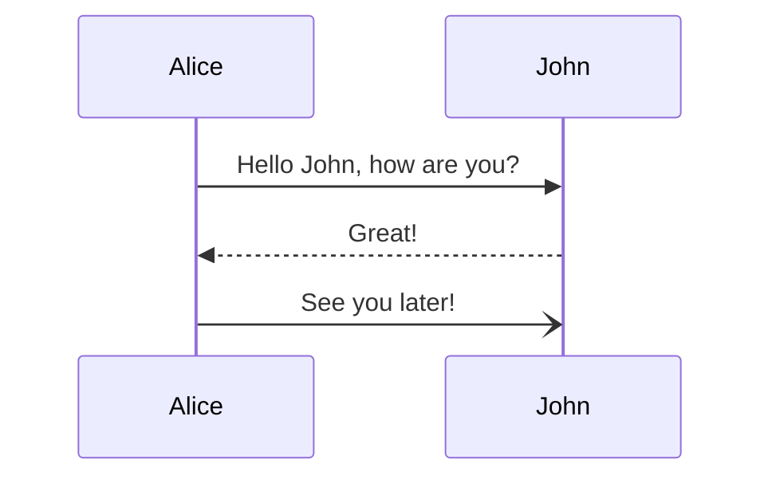
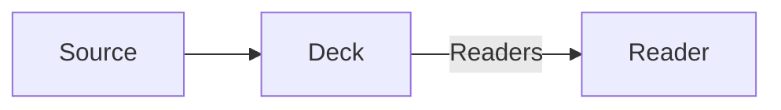
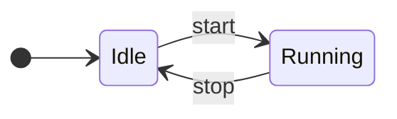
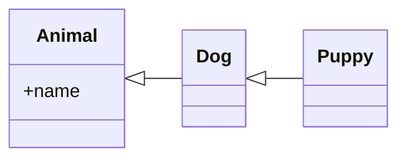

# Saburto Decks

A deck is **one file**. It sits in the page like any other component, showing
one slide at a time, and the same file presents full screen.

---

## Writing a deck

Slides are separated by a horizontal rule. That is ordinary Markdown, so the
file stays readable in any editor and any Markdown tool.

- `---` on its own line starts the next slide
- headings, paragraphs, lists, links, *emphasis* and `inline code` all work
- frontmatter above the first rule describes the deck itself

---

## Presenting it

Embedded, the deck shows one slide at a time in the space the page gives it.
Press **Full screen** to present it, or let the host page do it.

Press **Escape** to come back, and you return to *this* slide with the page
scrolled exactly where you left it. The arrows, Space, Page Up, Page Down, Home
and End all work too.

---

## Code

Fenced code is highlighted at build time, with [Shiki](https://shiki.style) — never in the browser.
Name the file, and mark the lines worth showing.

```tsx [Post.tsx] {1|5|hide|none}
import { Deck } from '@saburto/saburto-decks'
import slides from './my-deck.mdx'

export default function Post() {
  return <Deck slides={slides} />
}
```

---

## Steps

A block can step through what it shows, exactly as Slidev does.

```tsx [Post.tsx] {all|4|6|6-7|9|all}
import { useRef } from 'react'
import { Deck } from '@saburto/saburto-decks'
import type { DeckHandle } from '@saburto/saburto-decks'
import slides from './my-deck.mdx'

export default function Post() {
  const deck = useRef<DeckHandle>(null)

  return <Deck ref={deck} slides={slides} />
}
```

---

## Diagrams

A [Mermaid](https://mermaid.js.org) diagram is drawn, not printed. A sequence diagram
is revealed the way it declares itself: one participant, then one message at a time.



---

## Flowcharts

A flowchart is revealed the same way: each node, then each edge.



---

## State diagrams

A state diagram is revealed the same way again: each state, then each transition.



---

## Class diagrams

And a class diagram: each class, then each relation.


