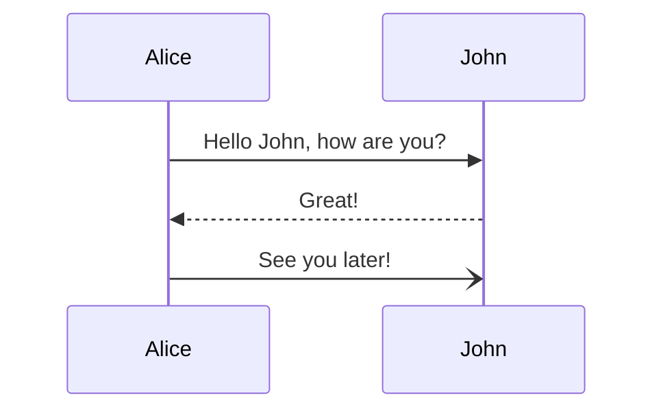
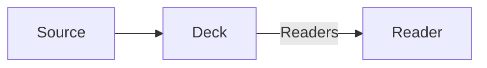
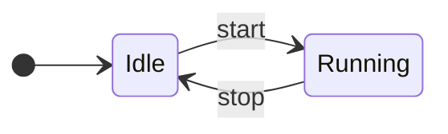
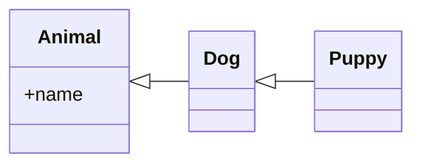

import picture from './layout-picture.svg'

# Saburto Decks

A deck is <Mark type="highlight">**one file**</Mark>. It sits in the page like any
other component, showing one slide at a time, and the same file presents full
screen.

---

## Contents

<Contents />

---

## Writing a deck

Slides are separated by a <Mark type="underline">horizontal rule</Mark>. That is
ordinary Markdown, so the file stays readable in any editor and any Markdown tool.

- `---` on its own line starts the next slide
- headings, paragraphs, lists, links, _emphasis_ and `inline code` all work
- frontmatter above the first rule describes the deck itself

---

## Presenting it

Embedded, the deck shows one slide at a time in the space the page gives it.
Press <Mark type="box">Full screen</Mark> to present it, or let the host page do it.

Press <Mark type="circle" color="accent" at={2}>Escape</Mark> to come back, and
you return to _this_ slide with the page scrolled exactly where you left it. The
arrows, Space, Page Up, Page Down, Home and End all work too.

---

## Code

Fenced code is highlighted at build time, with [Shiki](https://shiki.style) — never in the browser.
Name the file, and mark the lines worth showing.

```tsx [Post.tsx] {1|5|hide|none}
import { Deck } from '@saburto/saburto-decks'
import slides from './my-deck.mdx'

export default function Post() {
  return <Deck slides={slides} />
}
```

---

## Steps

A block can step through what it shows, exactly as Slidev does.

```tsx [Post.tsx] {all|4|6|6-7|9|all}
import { useRef } from 'react'
import { Deck } from '@saburto/saburto-decks'
import type { DeckHandle } from '@saburto/saburto-decks'
import slides from './my-deck.mdx'

export default function Post() {
  const deck = useRef<DeckHandle>(null)

  return <Deck ref={deck} slides={slides} />
}
```

---

## Diagrams

A [Mermaid](https://mermaid.js.org) diagram is drawn, not printed. A sequence diagram
is revealed the way it declares itself: one participant, then one message at a time.



---

## Flowcharts

A flowchart is revealed the same way: each node, then each edge.



---

## State diagrams

A state diagram is revealed the same way again: each state, then each transition.



---

## Class diagrams

And a class diagram: each class, then each relation.



---

## Motion

An object can arrive on a step, and it can move on one. It keeps its place
while it waits, so nothing else on the slide moves when it shows up.

<Appear at={2}>This line arrives on the first step.</Appear>

<Move at={3} x={120}><strong>And this one slides right on the next.</strong></Move>

Reading it backwards moves the line back, and takes the first one away again.

---

<Columns title="Two columns">

Two columns are for two things that belong together: before and after, a
problem and its fix, one idea against another.

Each paragraph under the title is one column. A column can hold anything a
slide holds — a stack of blocks, a picture, a diagram — and the pair is scaled
to the deck's box like every other slide.

</Columns>

---

<Columns title="A picture beside the text" ratio={[3, 2]}>

A picture is a column too. Put a `<Figure>` on one side and the text on the
other, and the deck lays them out like any two columns; `ratio` decides how
the width is shared.

<Figure src={picture} alt="An illustration of a slide with a title, text and a diagram" caption="A figure fills its column, keeps the picture's proportions, and carries a caption." />

</Columns>

---

<Columns title="Two subtitles, four blocks">

<Stack>

## Why

<Block>Two blocks of text sit under each subtitle, so the slide reads as two small sections rather than four loose boxes.</Block>

<Block>A subtitle over a group is an ordinary heading inside the column; the stack is what keeps the group together as one column.</Block>

</Stack>

<Stack>

## How

<Block>Give a two-column layout two stacks and each stack becomes one of the columns.</Block>

<Block>Anything a slide holds can be a block: text, a list, a figure, a diagram, another layout.</Block>

</Stack>

</Columns>

---

<Grid title="A grid of four" columns={2}>

<Block title="One">The blocks of a grid are its children, laid out in as many columns as asked.</Block>

<Block title="Two">Each block keeps its own heading, so a cell reads on its own.</Block>

<Block title="Three">Two columns of two blocks: the classic 2×2.</Block>

<Block title="Four">The grid is centred in the room under the title.</Block>

</Grid>

---

<Grid title="Six blocks" columns={3}>

<Block title="One">Six blocks in three columns make a 3×2.</Block>

<Block title="Two">Each block is short and of equal weight.</Block>

<Block title="Three">The blocks wrap into as many rows as they need.</Block>

<Block title="Four">A cell can be a block, a paragraph, a figure or a diagram.</Block>

<Block title="Five">The blocks are top-aligned in their row.</Block>

<Block title="Six">The whole grid is scaled to fit the deck.</Block>

</Grid>

---

<Bullets title="A title and bullets" lead="The list is ordinary Markdown.">

- one file, read embedded or presented
- the same slide scaled to any box
- no script to paste, no second source

</Bullets>

---

<Columns title="A diagram beside the text">


<div>

A diagram is a column too. Put a Mermaid fence on one side and a passage on
the other, and the deck draws it there like any other column.

The flowchart is revealed a node and an edge at a time, exactly as it is on a
slide of its own.

</div>

</Columns>

---

<Columns title="Three blocks in a column">

<Stack>

<Block title="One">A column can be a stack of short blocks.</Block>

<Block title="Two">A two-column layout places its children side by side, so three blocks have to be one child.</Block>

<Block title="Three">A stack is that child, and it spaces the blocks in the deck's own units.</Block>

</Stack>

The typical layouts are one question: what should the reader's eye do first? A
grid answers it with rows and columns; a stack answers it with order; a
picture answers it in one look.

</Columns>

---

<Slides src="./reused/imported.mdx" />

---

## Included inside a slide

An include does not have to be a slide of its own. Put one inside a slide and
its content joins that slide, steps and all:

<Slides src="./reused/inline.mdx" />

The slide stays one slide, and the included content is part of it.

---

<style>{`
/* The slide opens on its text alone: until the first arrow's step the passage
   is centred across the whole slide, and the column that will hold the
   explanations keeps its height without showing anything, so the type size
   the slide settles on does not move when the arrows arrive (R16, R19).
   Only where the two columns really sit side by side; stacked, they just
   follow one another. */
@media (min-width: 40rem) {
  :host([data-step="0"]) .sd-arrows-demo > div > :first-child {
    grid-column: 1 / -1;
    grid-row: 1;
    align-self: center;
    max-width: 32em;
    margin-inline: auto;
  }
  :host([data-step="0"]) .sd-arrows-demo > div > :last-child {
    grid-column: 2;
    grid-row: 1;
  }
}
`}</style>

<Columns title="Arrows" className="sd-arrows-demo">

<div>

A deck is <span data-id="arrow-word-file">**one file**</span>.

A code block can be a <span data-id="arrow-word-step">**step**</span>.

Presenting <span data-id="arrow-word-screen">**fills the screen**</span>.

</div>

<Stack gap={1.4}>

<div data-id="arrow-file">

<Appear at={2}>

**One file.** The deck and the page it is read in are the same text.

</Appear>

</div>

<div data-id="arrow-step">

<Appear at={3}>

**A step.** Any part can wait for the reader's next move.

</Appear>

</div>

<div data-id="arrow-screen">

<Appear at={4}>

**The screen.** The same slide, on the whole viewport.

</Appear>

</div>

</Stack>

</Columns>

<Arrow at={2} from="[data-id=arrow-file]@left" to="[data-id=arrow-word-file]@right" color="accent" />

<Arrow at={3} from="[data-id=arrow-step]@left" to="[data-id=arrow-word-step]@right" arc={-0.4} />

<Arrow at={4} from="[data-id=arrow-screen]@left" to="[data-id=arrow-word-screen]@right" arc={0.4} headType="polygon" lineStyle="dashed" headSize={14} color="muted" width={2} />

---

<Stage className="flex flex-col gap-[1.2em]">

## A page that fills the deck

<div className="grid flex-1 grid-cols-2 items-start gap-[2em] text-[0.85em] leading-snug text-sd-muted">

<div>

A slide is normally one column of text that the deck centres in its box and fits. That is the right
shape for a passage, and the wrong one for a page: a title band, columns that reach the edges, a
foot at the foot have nowhere to stand.

</div>

<div>

`<Stage>` is the room the deck has for a slide, measured and handed over — the whole width, the
whole height, at whatever size the host gave the deck. Inside it, a slide is ordinary CSS.

</div>

</div>

<p className="text-[0.7em] text-sd-muted">

A foot, at the foot of the deck's own box. The deck still shrinks the type rather than scrolling,
and follows its own box when the host resizes it.

</p>

</Stage>
